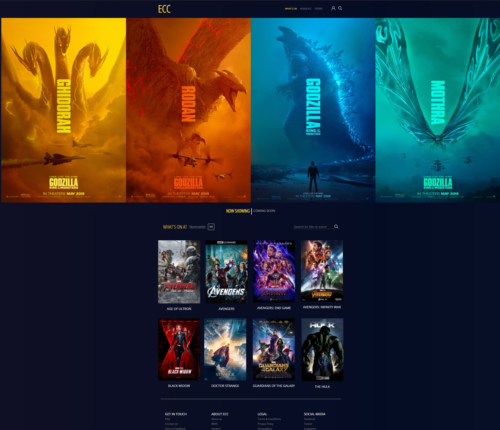
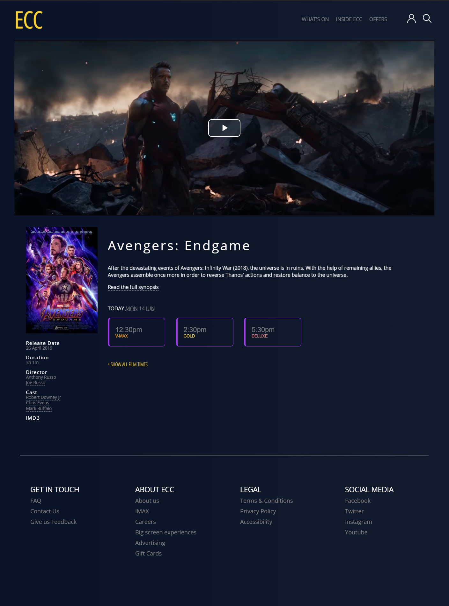

# IT5012 - Project 2 - Client-side Web Project

[Eye Candy Cinemas](https://eyecandycinema.netlify.app/) :point_left:

 

## Learning Objectives
- Design and build website using current web standards
- Understand usability, utility, accessability for web design
- Web development life cycle
- User Centered Design and UX

## Study materials 
- [usability.org](usability.org)
- UX Pin - UX Design 2015/2016 - Successful Trends for Digital Products
- [goodui.org](goodui.org)
- [material.io](material.io)

### Planning
 Identify user goals and purpose
 Allow users to view movie details and make bookings via web portal
 

 
